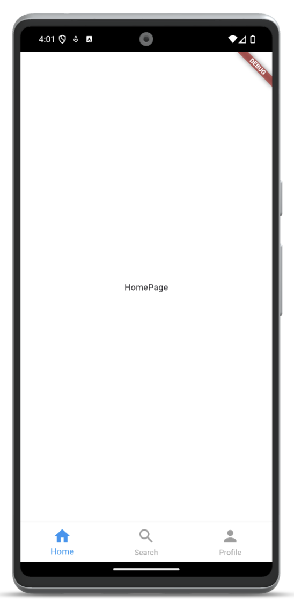

<!--
This README describes the package. If you publish this package to pub.dev,
this README's contents appear on the landing page for your package.

For information about how to write a good package README, see the guide for
[writing package pages](https://dart.dev/guides/libraries/writing-package-pages).

For general information about developing packages, see the Dart guide for
[creating packages](https://dart.dev/guides/libraries/create-library-packages)
and the Flutter guide for
[developing packages and plugins](https://flutter.dev/developing-packages).
-->

## Adaptive Bottom Navigation

Adaptive Bottom Navigation is a Flutter package that provides an adaptive bottom navigation bar widget, supporting both iOS and Android platforms. The navigation bar automatically adapts its appearance to match the platform, ensuring a consistent and native-like user experience.

## Updated by [@badiniibrahim](https://github.com/badiniibrahim)

Liked some of my work? Buy me a coffee. Thanks for your support :heart:

<a href="https://buymeacoffee.com/toncopilote" target="_blank"></a>

## Screenshot



## Features

- Adaptive design for iOS and Android platforms.
- Customizable icons, labels, and pages.
- Supports various customization options for colors, sizes, animations, and decorations.
- Easy to use with a simple API.
- Built with GetX for state management.

## Getting started

Add the dependency to your `pubspec.yaml` file:

```yaml
dependencies:
  ...
    adaptive_bottom_navigation: latest_version
```

## Here's a complete example showcasing the usage of the AdaptiveBottomNavigation widget:

```dart
void main() {
  runApp(MyApp());
}

class MyApp extends StatelessWidget {
  @override
  Widget build(BuildContext context) {
    return GetMaterialApp(
      home: HomeScreen(),
    );
  }
}

class HomeScreen extends StatelessWidget {
  @override
  Widget build(BuildContext context) {
    return AdaptiveBottomNavigation(
      icons: [Icons.home, Icons.search, Icons.person],
      labels: ['Home', 'Search', 'Profile'],
      pages: [HomePage(), SearchPage(), ProfilePage()],
      selectedColor: Colors.blue,
      unselectedColor: Colors.grey,
      backgroundColor: Colors.white,
      iconSize: 30.0,
      animationDuration: Duration(milliseconds: 300),
      animationIndicatorCurve: Curves.easeIn,
      animationIconCurve: Curves.easeOut,
      indicatorDecoration: BoxDecoration(
        color: Colors.blue,
        borderRadius: BorderRadius.circular(10),
      ),
      itemDecoration: BoxDecoration(
        border: Border(
          top: BorderSide(color: Colors.grey, width: 0.5),
        ),
      ),
      bottomNavigationDecoration: BoxDecoration(
        boxShadow: [BoxShadow(color: Colors.black12, blurRadius: 10)],
      ),
      height: 60.0,
      indicatorHeight: 4.0,
      indicatorSpaceBottom: 2.0,
    );
  }
}

class HomePage extends StatelessWidget {
  @override
  Widget build(BuildContext context) {
    return Center(child: Text('Home Page'));
  }
}

class SearchPage extends StatelessWidget {
  @override
  Widget build(BuildContext context) {
    return Center(child: Text('Search Page'));
  }
}

class ProfilePage extends StatelessWidget {
  @override
  Widget build(BuildContext context) {
    return Center(child: Text('Profile Page'));
  }
}

```

### Parameters

- **`icons`**: (required) - A list of icons to display in the navigation bar.
- **`labels`**: (required) - A list of labels corresponding to the icons.
- **`pages`**: (required) - A list of pages to navigate to when an icon is tapped.
- **`iconSize`**: double - The size of the icons. Default is 24.0.
- **`selectedColor`**: Color - The color of the selected icon. Default is Colors.black.
- **`unselectedColor`**: Color - The color of the unselected icons. Default is Colors.black38.
- **`backgroundColor`**: Color - The background color of the navigation bar. Default is Colors.white.
- **`animationDuration`**: Duration - The duration of the animations. Default is Duration(milliseconds: 300).
- **`animationIndicatorCurve`**: Curve - The curve for the indicator animation. Default is Curves.easeIn.
- **`animationIconCurve`**: Curve - The curve for the icon animation. Default is Curves.easeOut.
- **`indicatorDecoration`**: BoxDecoration? - The decoration for the indicator.
- **`itemDecoration`**: BoxDecoration? - The decoration for each item.
- **`bottomNavigationDecoration`**: BoxDecoration? - The decoration for the entire navigation bar.
- **`height`**: double - The height of the navigation bar. Default is 60.0.
- **`indicatorHeight`**: double - The height of the indicator. Default is 4.0.
- **`indicatorSpaceBottom`**: ouble - The space between the indicator and the bottom of the navigation bar. Default is 2.0.

## LinkedIn

Connect with me on [LinkedIn](https://www.linkedin.com/in/badini-ibrahim-sawadogo-306b119b/)
